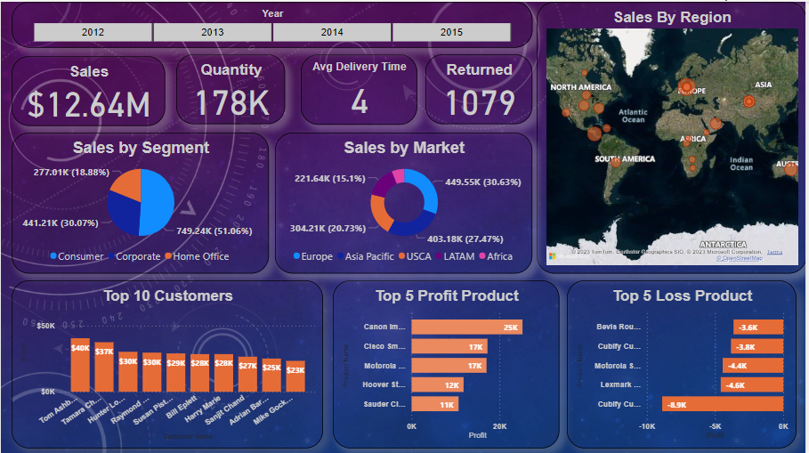

# Global_Superstore_Dashboard
This project showcases an interactive global superstore dashboard using PowerBI. It provides valuable insights into the sales performance, profitability, and customer segmentation of a global superstore. The dashboard enables data-driven decision-making, optimizing product and customer performance, and extracting actionable insights.

# Project Outline:
In today's competitive retail landscape, understanding and optimizing sales performance, profitability, and customer segmentation are paramount for success. Our global superstore faces challenges in effectively analyzing and utilizing its vast dataset to make data-driven decisions.
This project aims to address these challenges by creating an interactive PowerBI dashboard that provides comprehensive insights into our global superstore's operations.

# Data Cleaning and Preprocessing:
In this project, I used Power Query to perform robust data cleaning and preprocessing on global superstore dataset. Data cleaning and preprocessing are fundamental steps in ensuring that the data used for analysis is accurate, consistent, and ready for insightful visualization and analysis.
1. Data Integration
Power Query played a pivotal role in integrating data from these diverse sources into a unified dataset. We combined tables, transformed data types, and handled any data inconsistencies or duplications. This integration step laid the foundation for comprehensive analysis.
2. Handling Missing Data
Addressing missing data is critical for accurate analysis. Power Query allowed us to identify and handle missing values effectively. Depending on the context, I applied techniques such as imputation, removal of incomplete records, or interpolation to fill gaps in the data.
3. Data Cleansing
Dataset underwent thorough data cleansing using Power Query's capabilities. This involved identifying and correcting data inconsistencies, such as typos, duplicate entries, and irregular formatting. Ensuring data uniformity was crucial for meaningful analysis.

By harnessing the power of Power Query, I was able to prepare the data for in-depth analysis, enabling data-driven decision-making, and facilitating the creation of an insightful PowerBI dashboard.

# Key Features
Top 5 High-Profit and Low-Profit Products: Gain visibility into the most profitable and least profitable products in the global superstore. Analyze the factors contributing to their performance and identify areas for improvement.

Top 10 Customer Sales by Segment: Identify the top 10 customers in each segment based on their sales. Understand the preferences and buying patterns of different customer segments, allowing for targeted marketing and personalized customer experiences.

Sales Trends by Market and Region: Explore sales trends across different markets and regions. Understand which markets and regions are driving revenue growth and identify potential opportunities for expansion or improvement.
# Software Used
1) PowerBI
2) Excel

# Conclusion

## Recap of Key Points
In conclusion, the global superstore dashboard is a powerful tool for businesses to gain insights into sales performance, profitability, and customer segmentation. By utilizing the dashboard's key features, businesses can make data-driven decisions, optimize product and customer performance, and identify areas for improvement.

## Benefits of Using the Global Superstore Dashboard
The benefits of using the global superstore dashboard include:
1. Enhanced visibility of high-profit and low-profit products
2. Improved understanding of customer preferences and buying patterns
3. Identification of revenue growth drivers and market opportunities
4. Targeted marketing and personalized customer experiences
5. Data-driven decision-making for business optimization

## Next Steps for Implementing Data-Driven Decision-Making
1. To implement data-driven decision-making, businesses should:
2. Ensure data accuracy and reliability
3. Train employees on data analysis and interpretation
4. Establish a culture of data-driven decision-making
5. Continuously monitor and evaluate performance metrics
6. Regularly update and refine the global superstore dashboard

# Limitations and Challenges:
1. Data Messiness: Dealing with messy data, like missing values and inconsistent formatting
2. Resource Constraints: Working with limited computational resources, which can slow down data processing.
3. Time Crunch: Balancing the need for thorough data analysis with project deadlines.
4. Data Size: Handling and analyzing large datasets, which can be time-consuming.
5. Data Understanding: Grappling with understanding the data and its context.

